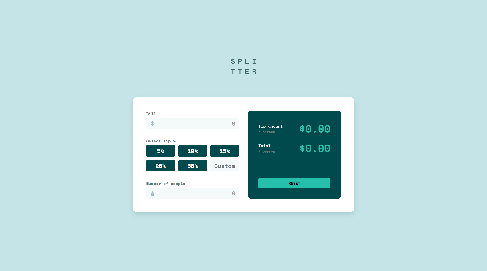

# Frontend Mentor - Tip calculator app solution

This is a solution to the [Tip calculator app challenge on Frontend Mentor](https://www.frontendmentor.io/challenges/tip-calculator-app-ugJNGbJUX). Frontend Mentor challenges help you improve your coding skills by building realistic projects.

## Table of contents

- [Overview](#overview)
  - [The challenge](#the-challenge)
  - [Screenshot](#screenshot)
  - [Links](#links)
- [My process](#my-process)
  - [Built with](#built-with)
  - [What I learned](#what-i-learned)
- [Author](#author)

## Overview

### The challenge

Users should be able to:

- View the optimal layout for the app depending on their device's screen size
- See hover states for all interactive elements on the page
- Calculate the correct tip and total cost of the bill per person

### Screenshot



### Links

- Solution URL: [https://github.com/KH-Ray/tip-calculator-app](https://your-solution-url.com)
- Live Site URL: [Add live site URL here](https://your-live-site-url.com)

## My process

### Built with

- Semantic HTML5 markup
- Flexbox
- CSS Grid
- [React](https://reactjs.org/) - JS library

### What I learned

```css
main {
  height: 100vh;
  font-family: "Space Mono", monospace;
  font-weight: 700;
  background-color: hsl(185, 41%, 84%);
  position: relative;
  flex-direction: column;
}

.left {
  display: flex;
  flex-direction: column;
  gap: 3.2rem;
}

.logo {
  margin-bottom: 8rem;
}

.container {
  background-color: hsl(0, 0%, 100%);
  border-radius: 16px;
  box-shadow: 0 8px 16px hsla(183, 100%, 15%, 0.15);
  padding: 4.8rem;
  gap: 3.2rem;
}

.label {
  display: flex;
  margin-bottom: 0.4rem;
  font-size: 1.4rem;
  color: hsl(186, 14%, 43%);
  cursor: default;
}

label span {
  margin-left: auto;
  color: #c92a2a;
}

.input {
  font-family: "Space Mono", monospace;
  font-size: 2rem;
  color: hsl(183, 100%, 15%);
  text-align: right;
  border: none;
  width: 100%;
  height: 3.8rem;
  padding: 1.2rem;
  background-color: hsl(189, 41%, 97%);
  border-radius: 4px;
}

.input::placeholder {
  color: hsl(184, 14%, 56%);
}

.input-invalid:focus-visible {
  outline: 2px solid #c92a2a !important;
}

.left button {
  height: 4rem;
  font-family: "Space Mono", monospace;
  font-size: 2rem;
  border: none;
  border-radius: 4px;
  background-color: hsl(183, 100%, 15%);
  color: hsl(0, 0%, 100%);
}

.left button:hover {
  background-color: hsl(185, 41%, 84%);
  color: hsl(183, 100%, 15%);
  cursor: pointer;
}

.custom-tip {
  height: 4rem;
  width: 100%;
  font-family: "Space Mono", monospace;
  font-size: 2rem;
  color: hsl(183, 100%, 15%);
  text-align: right;
  border: none;
  background-color: hsl(189, 41%, 97%);
  border-radius: 4px;
  padding: 0.8rem;
}

.custom-tip::placeholder {
  text-align: center;
}

.tips {
  gap: 1.2rem;
}

.custom-tip:focus-visible,
.input:focus-visible {
  caret-color: hsl(172, 67%, 45%);
  outline: 2px solid hsl(172, 67%, 45%);
}

.right {
  flex-direction: column;
  gap: 1.6rem;
  background-color: hsl(183, 100%, 15%);
  border-radius: 8px;
  padding: 3.6rem;
}

.result-container {
  align-items: center;
  justify-content: space-between;
}

.result-name {
  display: flex;
  flex-direction: column;
  color: hsl(0, 0%, 100%);
  font-size: 1.4rem;
}

.result-name span {
  color: hsl(186, 14%, 43%);
  font-size: 1.2rem;
}

.result-price {
  font-size: 3.6rem;
  color: hsl(172, 67%, 45%);
}

.reset {
  border: none;
  font-family: "Space Mono", monospace;
  background-color: hsl(172, 67%, 45%);
  padding: 0.8rem;
  border-radius: 4px;
  margin-top: auto;
}

.reset:hover {
  cursor: pointer;
  background-color: hsl(185, 41%, 84%);
}

.selected {
  color: hsl(183, 100%, 15%) !important;
  background-color: hsl(172, 67%, 45%) !important;
}

.hidden {
  display: none;
}
```

```js
export default function App() {
  const [bill, setBill] = useState("");
  const [numOfPeople, setNumOfPeople] = useState("");
  const [tip, setTip] = useState(0);
  const [tipAmount, setTipAmount] = useState(0);
  const [total, setTotal] = useState(0);

  return (
    <Container>
      <Logo />
      <Calculator>
        <div className="container grid grid--2-cols">
          <CalculatorLeft
            bill={bill}
            numOfPeople={numOfPeople}
            tip={tip}
            setBill={setBill}
            setNumOfPeople={setNumOfPeople}
            setTip={setTip}
            handleTipAmount={setTipAmount}
            handleTotal={setTotal}
          />
          <CalculatorRight
            tipAmount={tipAmount}
            total={total}
            setBill={setBill}
            setNumOfPeople={setNumOfPeople}
            setTip={setTip}
          />
        </div>
      </Calculator>
    </Container>
  );
}

function Container({ children }) {
  return <main className="flex flex--center">{children}</main>;
}

function Calculator({ children }) {
  return <>{children}</>;
}

function CalculatorLeft({
  bill,
  numOfPeople,
  tip,
  setBill,
  setNumOfPeople,
  setTip,
  handleTipAmount,
  handleTotal,
}) {
  useEffect(
    function () {
      const tipAmount = (bill / numOfPeople) * (tip / 100);
      const total = bill / numOfPeople + tipAmount;

      handleTipAmount(tipAmount);
      handleTotal(total);
    },
    [bill, numOfPeople, tip, handleTipAmount, handleTotal]
  );

  return (
    <div className="left">
      <Form
        label="Bill"
        forLabel="bill"
        bgUrl={dollar}
        input={bill}
        handleInput={setBill}
      />
      <TipSelect>
        <Button amount={5} handleTip={setTip} tip={tip} />
        <Button amount={10} handleTip={setTip} tip={tip} />
        <Button amount={15} handleTip={setTip} tip={tip} />
        <Button amount={25} handleTip={setTip} tip={tip} />
        <Button amount={50} handleTip={setTip} tip={tip} />
        <CustomTip handleTip={setTip} />
      </TipSelect>
      <Form
        label="Number of people"
        forLabel="numOfPeople"
        bgUrl={person}
        input={numOfPeople}
        handleInput={setNumOfPeople}
      />
    </div>
  );
}

function CalculatorRight({
  tipAmount,
  total,
  setBill,
  setNumOfPeople,
  setTip,
}) {
  return (
    <div className="right flex">
      <Result resultName="Tip amount" result={tipAmount} />
      <Result resultName="Total" result={total} />
      <Reset
        setBill={setBill}
        setNumOfPeople={setNumOfPeople}
        setTip={setTip}
      />
    </div>
  );
}
```

## Author

- Frontend Mentor - [@UncertainlySure](https://www.frontendmentor.io/profile/UncertainlySure)
